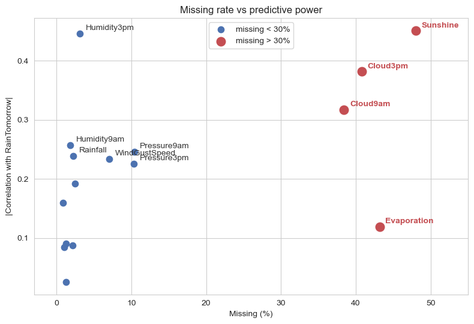
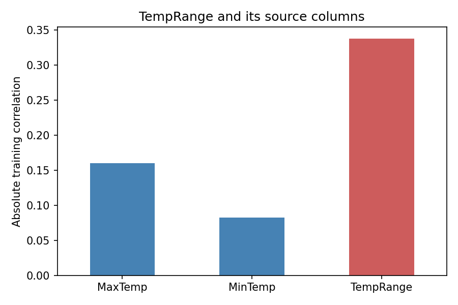

# Rain in Australia — feature engineering and preprocessing

Four-person CSCI 316 group project using 145,460 daily Australian weather observations to predict `RainTomorrow`. **My original contribution was sections (a) and (b): exploration, cleaning, derived features and the preprocessing pipeline.** Other members implemented model training, tuning and evaluation. Names remain in the notebook.

## Tech stack

   

**My original implementation:** data exploration, derived features and the scikit-learn preprocessing pipeline. Other members handled model training and evaluation in the original submission.

## What I worked on

Missingness alone is not a sufficient reason to discard a column. The training-data plot compares missing rates with absolute target correlation: highly incomplete sunshine/cloud measurements can still show useful association. `Evaporation` is dropped as a simple exploratory choice, while remaining numeric gaps are median-imputed and categorical gaps mode-imputed.



Five candidate differences are screened on training data. `TempRange = MaxTemp − MinTemp` has a stronger absolute linear correlation than either input alone; `HumidityChange` is also retained as a candidate. That does not establish incremental predictive value, because source columns remain and correlations miss nonlinear relationships.



`WeatherFeatureAdder(add_features=True/False)` makes the two derived columns optional. Dtype-based column selection lets both settings work without maintaining incompatible hard-coded feature lists. Raw `Date` is dropped in this implementation; a near-zero correlation with numeric month would not rule out seasonal or station-specific patterns.

## Revised validation workflow

The notebook is now a **portfolio revision of the group submission**, not an unchanged submitted artifact. Rows without a target are removed, then a stratified 80/20 split is made before target-based exploration. Imputation, scaling, encoding and the feature switch stay inside each fitted pipeline.

For a reproducible, manageable rerun, each of three model families searches four configurations using three-fold CV on a 20,000-row subset drawn only from training data. A diagnostic then changes only the feature switch at the selected model settings. Final models are fitted on the full training partition and evaluated on the holdout. This rerun changes the original search budget, so old and new scores should not be compared as though they came from the same experiment.

See [results.csv](results.csv) for holdout accuracy, rain precision/recall/F1 and AUC, and [feature_toggle_results.csv](feature_toggle_results.csv) for the controlled CV diagnostic. Selection of `add_features=True` alone is not proof of a stable benefit. The diagnostic reuses CV folds and is conditional on selected parameters.

## Rerun results

| Model | Accuracy | Rain precision | Rain recall | Rain F1 |
|---|---:|---:|---:|---:|
| Logistic regression | 84.98% | 0.735 | 0.515 | 0.606 |
| Random forest | 85.56% | 0.788 | 0.486 | 0.602 |
| Gradient boosting | 85.48% | 0.759 | 0.516 | 0.614 |

The majority no-rain baseline is about 77.58% accurate but detects no rain days. In the controlled feature diagnostic, enabling the derived features changes mean CV F1 by approximately +0.0034 for logistic regression, −0.0006 for random forest and +0.0033 for gradient boosting. These small, mixed changes do not establish a consistent improvement across model families.

## Run

Download `weatherAUS.csv` from [Rain in Australia on Kaggle](https://www.kaggle.com/datasets/jsphyg/weather-dataset-rattle-package) into `notebook/`; raw data are not committed.

```bash
pip install -r requirements.txt
jupyter notebook notebook/weather_task1_sklearn.ipynb
```

Run all cells. The notebook saves its figures and result tables; fitting the models takes several minutes. Python 3.11 and the dependency versions in `requirements.txt` were used for the portfolio rerun.

## Limits and contribution

Random splitting does not measure forecasting into future periods or transfer to unseen stations. Initial feature/drop decisions use the training partition outside the internal CV folds, so CV is not a fully nested evaluation of feature selection. The historical holdout had already been explored before this correction; it is not a fresh external benchmark. The limited parameter search may miss better configurations.

The original task split remains: I wrote exploration/preprocessing, while teammates wrote modelling/evaluation. Later portfolio maintenance changes the validation workflow and reruns all stages without reassigning authorship of the submitted team work. University ID numbers were removed while retaining names. A separate Spark assignment was not my implementation and is not included.
